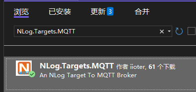
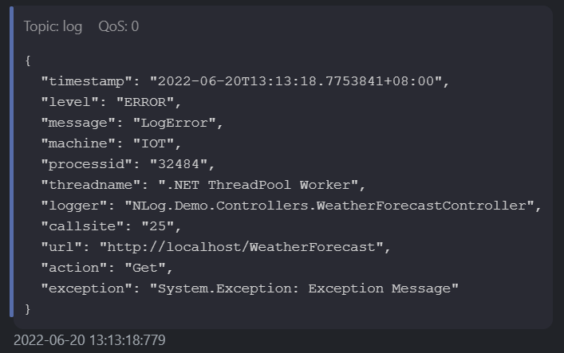
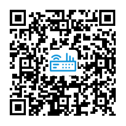

# NLog自定义Target之MQTT
> 
> **NLog**是.Net中**最流行**的日志记录开源项目(**之一**)，它*灵活*、*免费*、*开源*
> 
> 官方支持**文件**、**网络**(Tcp、Udp)、**数据库**、**控制台**等输出
> 
> 社区支持**Elastic**、**Seq**等日志平台输出

## 实时日志需求
> 在工业物联网等特定场景下需要**实时获取日志**信息
> 
> 工业物联网领域常用的是**mqtt协议**
> 
> 那我们就使用**NLog** 自定义一个**Target**，将日志输出到**MqttServer**
>
> **Web**通过**Mqtt**(websocket)**实时获取日志**，而**不是**传统的通过WebApi**轮询**日志


## NLog自定义Target
1. [官方文档](https://github.com/NLog/NLog/wiki/How-to-write-a-custom-target)介绍了如何自定义Target，可以获取到*一串*日志消息，无法获取结构化消息
2. 需要时用使用自定义**Field**来完成这部分工作
```csharp title="Field.cs"
/// <summary>
/// Additional field details
/// </summary>
[NLogConfigurationItem]
public class Field
{
    /// <summary>
    /// Name of additional field
    /// </summary>
    [RequiredParameter]
    public string Name { get; set; }

    /// <summary>
    /// Value with NLog <see cref="NLog.Layouts.Layout"/> rendering support
    /// </summary>
    [RequiredParameter]
    public Layout Layout { get; set; }

    /// <summary>
    /// Custom type conversion from default string to other type
    /// </summary>
    /// <remarks>
    /// <see cref="System.Object"/> can be used if the <see cref="Layout"/> renders JSON
    /// </remarks>
    public Type LayoutType { get; set; } = typeof(string);

    /// <inheritdoc />
    public override string ToString()
    {
        return $"Name: {Name}, LayoutType: {LayoutType}, Layout: {Layout}";
    }
}
```

3. 重写**Write**方法
```csharp title="MqttTarget.cs"
protected override void Write(LogEventInfo logEvent)
{
    //default fields
    Dictionary<string, object> logDictionary = new()
    {
        { "timestamp", logEvent.TimeStamp },
        { "level", logEvent.Level.Name },
        { "message", RenderLogEvent(Layout, logEvent) }
    };

    //customer fields
    //这里都处理为字符串了，有优化空间
    foreach (var field in Fields)
    {
        var renderedField = RenderLogEvent(field.Layout, logEvent);

        if (string.IsNullOrWhiteSpace(renderedField))
            continue;

        logDictionary[field.Name] = renderedField;
    }

    SendTheMessage2MqttBroker(JsonConvert.SerializeObject(logDictionary));
}
```

## 使用
下面将使用*Nlog.Target.MQTT*,演示通过**web实时查看**应用程序的**日志**。

1. 创建WebApi项目
2. 引用NLog.Target.MQTT



3. 配置文件
```xml title="nlog.config"
<extensions>
    <add assembly="NLog.Web.AspNetCore"/>
    <!--<add assembly="NLog.Targets.MQTT"/>-->
    <add assembly="NLog.Targets.MQTT"/>
</extensions>

<!-- the targets to write to -->
<targets>
    <!-- MQTT Target  -->
    <target xsi:type="MQTT" name="mqtt" host="localhost" port="1883" username="UserName"  password="Password" topic="log"
            layout="${longdate}|${event-properties:item=EventId_Id:whenEmpty=0}|${level:uppercase=true}|${logger}|${message} ${exception:format=tostring}|url: ${aspnet-request-url}|action: ${aspnet-mvc-action}|${callsite}" >
        <field name="machine" layout="${machinename}" />
        <field name="processid" layout="${processid}" />
        <field name="threadname" layout="${threadname}" />
        <field name="logger" layout="${logger}" />
        <field name="callsite" layout="${callsite-linenumber}" />
        <field name="url" layout="${aspnet-request-url}" />
        <field name="action" layout="${aspnet-mvc-action}" />
        <field name="level" layout="${level:uppercase=true}" />
        <field name="message" layout="${message}" />
        <field name="exception" layout="${exception:format=toString}" />
    </target>
</targets>

<!-- rules to map from logger name to target -->
<rules>
    <logger name="*" minlevel="Trace" writeTo="mqtt" />
</rules>
```
4. 配置MQTTServer和NLog
```csharp title="Program.cs"
// ...
// NLog: Setup NLog for Dependency injection
builder.Logging.ClearProviders();
builder.Logging.SetMinimumLevel(Microsoft.Extensions.Logging.LogLevel.Trace);
builder.Host.UseNLog();

//AddHostedMqttServer
builder.Services.AddHostedMqttServer(mqttServer =>
    {
        mqttServer.WithoutDefaultEndpoint();
    })
    .AddMqttConnectionHandler()
    .AddConnections();

//Config Port
builder.WebHost.UseKestrel(option =>
{
    option.ListenAnyIP(1883, l => l.UseMqtt());
    option.ListenAnyIP(80);
});
var app = builder.Build();

// ...
//UseStaticFiles html js etc.
app.UseStaticFiles();
app.UseRouting();

//Websocket Mqtt
app.UseEndpoints(endpoints =>
{
    //MqttServerWebSocket
    endpoints.MapConnectionHandler<MqttConnectionHandler>("/mqtt", options =>
    {
        options.WebSockets.SubProtocolSelector = MqttSubProtocolSelector.SelectSubProtocol;
    });
});
// ...
```
5. Web连接MqttServer
```jsx  title="index.html"
// ...    
<script src="./jquery.min.js"></script>
<script src="./mqtt.min.js"></script>
<script src="./vue.js"></script>
// ...

var client = mqtt.connect('ws://' + window.location.host + '/mqtt', options);
client.on('connect',
    function() {
        client.subscribe('log',
            function(err) {
                if (!err) {
                    console.log("subed!");
                } else {
                    alert("subed error!");
                }
            });
    });
client.on('message',
    function(topic, message) {
        if (topic === 'log') {
            if (app.logs.length > 50)
                app.logs.length = 0;
            app.logs.unshift($.parseJSON(message.toString()));
        }
    });
// ...
```
6. 输出日志
```csharp title="WeatherForecastController.cs"  
// ...  
_logger.LogDebug("LogDebug!");
_logger.LogError(new Exception("Exception Message!"), "LogError!");

//new thread output log after 500ms
Thread thread = new Thread(ThreadProc);
thread.Name = "My Thread";
thread.Start();
// ...
```
7. 实时查看日志
   访问index.html

8. 通过Mqtt客户端订阅日志


## 源码
在这里[NLog.Targets.MQTT](https://github.com/iioter/NLog.Targets.MQTT):*https://github.com/iioter/NLog.Targets.MQTT*

## 相关链接
[1] NLog.Targets.MQTT:*https://github.com/iioter/NLog.Targets.MQTT*

[2] IoTGateway-Doc:*http://iotgateway.net/blog/NLog*

[3] NLog自定义Target:*https://github.com/NLog/NLog/wiki/How-to-write-a-custom-target*

## 交流
| 公众号:工业物联网网关 |    [QQ群:712105424](https://qm.qq.com/cgi-bin/qm/qr?k=e3Y8biyVdhDxx3LPbjvNY3TSNOEAmjp7&jump_from=webapi)  |
| ------ | ---- |
|  |  |